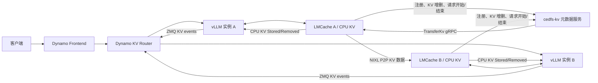

# CEDFS-KV 代码结构与协作链路分析

## 1. 文档范围

本文基于同一目录下以下工作树的静态代码分析，描述 `cedfs-kv` 在 Dynamo + vLLM + LMCache 组合中的职责、主要工作链路和仓库间接口：

| 仓库 | 分支 | 本文中的角色 |
| --- | --- | --- |
| `CedFs_KV` | `fix/meta_struct` | 全局 KV 元数据、热度与副本迁移决策 |
| `LMCache` | `feat/sdk` | KV 的实际存储、生命周期上报和实例间数据传输 |
| `vllm` | `fix/lmcache` | 推理执行、LMCache connector，以及 KV 事件向上游的适配 |
| `dynamo` | `integration-v1.1.1` | 请求入口、KV-aware 路由和 LMCache CPU cache 事件索引 |

这里的“多实例”主要指多个 vLLM + LMCache 推理实例共享一个 `cedfs-kv` 元数据服务。当前有效实现并不是多副本 `cedfs-kv` 元数据集群；这一边界会在后文说明。

## 2. 一句话架构

`cedfs-kv` 是控制面，不保存 KV tensor：LMCache 实例把本地 CPU KV 的新增、淘汰和请求生命周期上报给它；它用 token 前缀 radix tree 维护“哪个实例有哪个前缀”及热度，在压力不均时调用源 LMCache 的 gRPC 服务，再由 LMCache/NIXL 把真实 KV 数据复制到目标实例。Dynamo 同时消费 vLLM 转发的 LMCache CPU KV 事件，维护一份面向在线请求路由的独立索引。



这套系统实际包含两份用途不同的索引：

- CEDFS radix tree：用于全局副本位置、热度统计和主动迁移。
- Dynamo KV router index：用于请求到达时选择 KV 命中率高且负载合适的 worker。

Dynamo 当前不直接调用 CEDFS 的 `SearchKvBlock`；两者通过 LMCache 的缓存事件与迁移结果间接保持一致。

## 3. `CedFs_KV` 仓库结构

```text
CedFs_KV/
├── cedfs-proto/
│   ├── proto/kvcache.proto       # LMCache -> CEDFS 的元数据/请求上报；查询接口
│   └── proto/kvserver.proto      # CEDFS -> LMCache 的 TransferKv 接口
├── cedfs-kv/
│   ├── src/bin/main.rs           # CLI 和服务入口
│   ├── src/lib.rs                # Shared 状态、gRPC 服务装配、迁移主循环
│   ├── src/config.rs             # 配置解析与校验
│   ├── src/hash.rs               # 与 vLLM/LMCache 对齐的分块前缀哈希
│   ├── src/kv_radix.rs           # KV 前缀树、实例倒排索引、热度/压力/候选选择
│   ├── src/network/              # 两组 tonic gRPC service
│   ├── src/operation/            # 注册、增删、查询、请求生命周期、迁移 RPC
│   ├── src/transfer/squnence.rs  # 活跃请求及其块引用跟踪
│   └── src/tokenizers.rs         # prompt 查询所需的模型 tokenizer
└── scheduler/                    # 当前为空，且不在 workspace members 中
```

`cedfs-proto` 是跨语言契约。`kvcache.proto` 暴露两组服务：

- `KvMeta2Data`：`UploadKvMeta`、`RegisterInstance`、`RemoveKvMeta`、`NewRequest`、`RequestEnd`，由 LMCache 插件调用。
- `KvMeta2Meta`：`SearchKvBlock`、`SearchKvBlockByPrompts`，供潜在的外部路由/查询方调用。

`kvserver.proto` 定义 `lmcache.LmcacheServer/TransferKv`，方向与前者相反：CEDFS 是客户端，源 LMCache 实例是服务端。

## 4. CEDFS 内部核心数据结构

### 4.1 `Shared`

`Shared` 是所有 gRPC handler 共享的内存状态，主要包括：

- `local_data_server_collect`：向当前元数据服务注册的推理实例。
- `global_data_server_collect`、`data_server_to_meta_server`：按 meta server 组织的实例目录。
- `kv_radix`：全局 KV 前缀树。
- `hasher`：token block 的 local hash 和累计 sequence hash 生成器。
- `active_squence`：活跃请求所引用的块。
- 压力迁移的 in-flight、带宽冷却和触发计数状态。

服务启动时加载配置和 tokenizer，创建上述纯内存结构，然后在同一监听地址上注册 `KvMeta2Data` 与 `KvMeta2Meta` 两个 tonic service。

### 4.2 `KvRadixTree`

一个 `RadixBlock` 保存：

- `local_hash`：当前 token chunk 自身的哈希，用作父节点的 child key。
- `seq_hash`：从首块累计到当前块的前缀哈希，也是跨仓库传递的块标识。
- `position`、`offset`、原始 `tokens`。
- 持有该块的 `servers` 集合。
- `heat` 与 `last_access`。

树之外还有两类索引：

- `lookup[server_id][seq_hash] -> node`，用于按实例快速计算连续前缀和压力。
- `block_index[seq_hash] -> node`，用于迁移和删除时按全局 hash 定位。

查询不是“每块分别命中即可”，而是从根开始逐块遍历，并持续取各块 `servers` 的交集，因此返回的是每个实例真正连续可用的前缀 token 长度。

### 4.3 哈希一致性

生产组合应使用 `sha256_cbor`。CEDFS 将 token 按 `block_size` 切分，按下式生成累计前缀 hash：

```text
H0 = sha256_cbor(PYTHONHASHSEED 字符串)
Hi = sha256_cbor((H{i-1}, tuple(tokens_of_block_i), ()))
```

这与当前 LMCache `TokenDatabase` 对 vLLM hash 函数和 `NONE_HASH` 的复用相对应。要让三个进程得到同一个 32-byte hash，必须同时满足：

- CEDFS `hash_algorithm = "sha256_cbor"`。
- LMCache `pre_caching_hash_algorithm: "sha256_cbor"`。
- vLLM 使用对应的 prefix caching hash 算法。
- 所有进程使用相同且显式设置的 `PYTHONHASHSEED`，仓库示例使用 `0`。
- CEDFS `block_size` 与 LMCache `chunk_size`，以及参与路由的 vLLM/Dynamo hash block 粒度一致。
- `unfull_chunk` 语义一致；否则末尾不足一个 block 的元数据会产生差异。

CEDFS 在 `sha256_cbor` 模式下缺少 `PYTHONHASHSEED` 会启动失败，这是必要的 fail-fast；LMCache 示例和 Dynamo 的 KV router 示例也显式设置了该变量。

## 5. 主要工作链路

### 5.1 实例启动与注册

1. Dynamo 启动 vLLM worker，并通过 `LMCacheConnectorV1` 加载 LMCache。
2. LMCache 读取 `LMCACHE_CONFIG_FILE`，动态加载：
   - storage plugin `KvTransferBackend`；
   - migration plugin `GlobalKvMigrationPlugin`。
3. migration plugin 创建 `KvCacheClient`，连接 `globalkv_meta_host:globalkv_meta_port`。
4. `KvCacheClient` 以 `hash("ip:http_port") & 0xffffffff` 生成 `server_id`，把 HTTP、NIXL init、gRPC、模型名和 URL 注册到 CEDFS。
5. CEDFS 将实例写入本地/全局实例目录，并建立 data server 到 meta server 的映射。
6. 同一个 LMCache plugin 在 `kv_transfer_rpc_port` 启动 `LmcacheServer/TransferKv`，同时 `KvTransferBackend` 在 `kv_transfer_init_port` 接受 NIXL/ZMQ 建连和数据传输。

这里有三个不同端口，不能混用：

| 端口 | 被谁访问 | 用途 |
| --- | --- | --- |
| `http_port` | Dynamo/客户端 | vLLM OpenAI HTTP 服务 |
| `rpc_port` | CEDFS | 下达 `TransferKv` 控制请求 |
| `init_port` | 另一 LMCache 实例 | NIXL 元数据交换、内存注册和 KV 数据搬运 |

### 5.2 KV 写入、命中和淘汰上报

写入链路：

```text
vLLM 计算 KV
  -> LMCacheEngine.store() 把 KV tensor 写入 LocalCPUBackend
  -> metadata_reporter.on_kv_stored(tokens)
  -> UploadKvMeta(server_id, tokens)
  -> CEDFS 按 block_size 重算 seq_hash
  -> kv_radix.store_blocks(server_id, blocks)
```

Reporter 接口预留了 `on_kv_retrieved(hit_tokens)`，它最终也会复用 `UploadKvMeta`。不过当前工作树中 `_upload_hit_kv_metadata()` 只有定义、没有调用点，因此“读取命中后再次登记持有者”并不属于当前实际工作链路；当前有效的元数据新增主要来自正常 store 和迁移完成后的 store event。

淘汰链路：

```text
LocalCPUBackend 删除块
  -> CacheRemoveEvent(medium="cpu")
  -> metadata_reporter.on_kv_removed(32-byte hashes)
  -> RemoveKvMeta(server_id, hashes)
  -> CEDFS 从块的 servers 中移除该实例
  -> 无剩余副本时剪枝
```

删除时，CEDFS 还会按删除前的副本数扣除该副本分摊的热度。

### 5.3 请求生命周期与热度

vLLM/LMCache adapter 在首次为请求检查外部 KV 命中前，上报 `NewRequest(request_id, tokens)`；为避免调度器重复探测造成重复计数，本地用 request-id set 去重。请求结束时上报 `RequestEnd` 并清除去重状态。

CEDFS 对 `NewRequest` 做两件事：

1. 对请求中已经存在于 radix tree 的每个前缀块将 `heat += 1`。
2. 将请求的 sequence hashes 放入 `ActiveSequences`，用引用对象记录活跃块；陈旧请求每 5 分钟惰性清理。

`RequestEnd` 释放活跃引用；若 `transfer_strategy=true`，每累计 `migration_check_request_interval` 个结束请求，异步触发一次压力再平衡。

### 5.4 CEDFS 主动副本迁移

实例压力定义为：

```text
pressure(server) = Σ block.heat / block.replica_count
```

迁移流程如下：

1. 找出压力最高的源实例和最低的目标实例。
2. 计算绝对阈值：

   ```text
   threshold = migration_delta * max_num_batch_tokens / block_size
   ```

3. 压力差不超过阈值则停止；否则检查该 source-target pair 是否正在迁移或仍处于模拟带宽冷却期。
4. 从“源持有、目标不持有”的块中选择能降低压力的候选；优先保证目标已经有父块，随后沿父子关系选择连续 suffix，避免产生没有前缀的孤立后缀。
5. 把候选的 32-byte `seq_hash` 顺序拼接，同时发送各块 offset、完整 token ids、目标 IP/init port 到源实例的 `TransferKv` gRPC。
6. 源 LMCache 查询并 pin `LocalCPUBackend` 中的块，取得其内存索引。
7. 源 `KvTransferBackend` 与目标 `init_port` 建立或复用连接；通过 NIXL 将源内存直接写/读到目标新分配的 CPU KV buffer。
8. 目标端跳过已存在的块，只提交新到达的块，并生成 migrated store events。
9. CEDFS 根据返回状态更新元数据：
   - 正数：迁移成功，把目标加入每个块的 server set。
   - `INT_MAX`：目标原本已拥有全部块，同样修复 server set。
   - `-1`：源实际不存在这些块，从元数据中删除源副本。
   - `-2` 或异常：本轮失败，不修改成功副本关系。
10. 成功迁移会按固定的 `96 KiB/token` 与配置带宽估算 source-target pair 的下一次允许时间；单次再平衡最多执行 16 轮。

当前 CEDFS 发送 `do_copy=true`，所以这是复制/扩副本而不是搬迁；源 KV 不会在成功后删除。

### 5.5 Dynamo 的在线 KV-aware 路由

Dynamo 走的是事件链路，而不是调用 CEDFS 查询：

1. LMCache 产生 CPU `CacheStoreEvent`/`CacheRemoveEvent`。
2. vLLM `LMCacheConnectorV1.get_kv_connector_kv_cache_events()` 将 LMCache store/remove 分别适配为 vLLM `BlockStored`/`BlockRemoved`。当前 vLLM 分支对 remove event 的适配是必要修复。
3. vLLM scheduler 收集 connector events，通过配置的 ZMQ publisher 发出。
4. Dynamo worker 订阅事件并转换存储层级。当前分支识别 `medium="cpu"` 为 `HostPinned`。
5. 设置 `DYN_CPU_KV_EVENTS_ONLY=true` 后，Dynamo 丢弃 GPU tier 事件，只用 LMCache CPU tier 事件更新 KV router index。
6. Dynamo frontend 使用 `--router-mode kv`。如果 `DYN_ROUTER_WORKER_SELECTION_FORMULA=kv-aware`，当前自定义代价为：

   ```text
   cost = miss_blocks * overlap_score_weight + (active_requests + 1)
   ```

   选择 cost 最小的 worker；平分时先选 running request 更少者，再按 tree size/随机方式打破平局。

CEDFS 迁移在目标 LMCache 生成 store event 后，事件会沿 `LMCache -> vLLM -> Dynamo` 链路进入 Dynamo 索引，因此后续请求可以被路由到新副本；CEDFS 无需直接写 Dynamo 状态。

## 6. 仓库之间的接口矩阵

| 调用方 | 被调用方 | 接口/载体 | 内容 |
| --- | --- | --- | --- |
| Dynamo | vLLM | Dynamo endpoint/HTTP | 把请求发送到选中的推理 worker |
| vLLM | LMCache | `LMCacheConnectorV1` Python API | KV lookup/load/store、请求完成通知 |
| LMCache | CEDFS | `KvMeta2Data` gRPC | 实例注册、KV 增删、请求开始/结束 |
| CEDFS | LMCache 源实例 | `LmcacheServer/TransferKv` gRPC | 下发迁移 hash、offset、tokens 和目标地址 |
| LMCache 源实例 | LMCache 目标实例 | ZMQ control + NIXL data path | 连接协商、内存注册和 KV tensor 搬运 |
| LMCache | vLLM | connector KV events | CPU cache stored/removed |
| vLLM | Dynamo | ZMQ KV event publisher | Dynamo router 的块位置增删 |
| 外部调用方（可选） | CEDFS | `KvMeta2Meta` gRPC | 按 token 或 prompt 查询实例及连续命中长度 |

## 7. 配置关系

下面列出跨仓库必须一致或相互引用的字段，不提供完整可运行配置，因为 `CedFs_KV` 当前仓库没有提交示例配置文件。

| CEDFS | LMCache/vLLM/Dynamo | 约束 |
| --- | --- | --- |
| `local_meta_server.ip/port` | `globalkv_meta_host/port` | LMCache 能访问 CEDFS gRPC |
| `block_size` | LMCache `chunk_size`、路由 hash block size | 必须对齐 |
| `hash_algorithm=sha256_cbor` | LMCache/vLLM `sha256_cbor` | 必须对齐 |
| `python_hash_seed` 或环境变量 | 所有进程 `PYTHONHASHSEED` | 值必须相同 |
| `transfer_strategy` | `enable_kv_transfer`、migration/storage plugins | 两侧都开启才会自动迁移 |
| CEDFS 记录的 `rpc_port` | LMCache `kv_transfer_rpc_port` | CEDFS 控制 RPC 目标 |
| CEDFS 记录的 `init_port` | LMCache `kv_transfer_init_port` | LMCache 数据传输目标 |
| `migration_network_bandwidth_mbps` | 实际迁移网络 | 当前只接受 500/1000/10000，用于冷却估算 |
| — | LMCache `enable_kv_events=true` | 让迁移/淘汰事件能进入 vLLM/Dynamo |
| — | Dynamo `DYN_CPU_KV_EVENTS_ONLY=true` | 路由索引跟踪 LMCache CPU tier |
| — | Dynamo frontend `--router-mode kv` | 启用 KV-aware routing |

同一 CEDFS 实例下参与互迁的 worker 还必须具备相同的模型、tokenizer、KV dtype、tensor/cache 布局以及兼容的并行配置。CEDFS 的迁移候选选择目前不按这些属性隔离，部署侧应按兼容组拆分元数据服务，或在代码中补充分组校验。

## 8. 当前实现边界与风险

### 8.1 已接通但需要部署保证

- 元数据是内存态，无持久化。CEDFS 重启会丢失实例、块位置和热度；LMCache 启动只注册实例，当前没有全量块重放协议。
- LMCache `server_id` 使用 Python `hash("ip:http_port")`。必须使用固定 `PYTHONHASHSEED`，并确保所有实例的 IP/HTTP port 组合唯一。
- `KvCacheClient` 注册的 `url` 当前写成 `http://localhost:<port>/v1`。跨主机使用 `SearchKvBlockByPrompts` 返回该 URL 时不可达；token 查询分支则重新拼接注册 IP 与 HTTP port，两者行为不一致。
- CEDFS 候选选择未按 `model_name`、dtype、TP/world size 分组。异构实例不能放入同一迁移池。
- 所有 gRPC channel 都是 insecure，接口也没有鉴权；只能放在可信网络内。

### 8.2 代码中存在，但不是当前主链路

- `KvMeta2Meta.SearchKvBlock*` 已实现，但当前 Dynamo、vLLM 和 LMCache 非生成代码中没有调用者。Dynamo 使用自己的事件索引。
- `meta_server_collect` 和 `remote_meta_servers` 仍在配置/状态中，但原来的 meta-to-meta 全量/增量同步 client、`GetKvMetaOp`、`UpdateKvMetaOp` 已整体注释，相关 RPC 也不在当前 proto 中。因此当前不能宣称多个 CEDFS 元数据服务会互相同步。
- `replica_pull`、`sync_interval` 等旧配置仍会被强制读取，但对应 `KvCacheClient::launch()` 没有编入模块，主程序也没有启动它们。
- `scheduler` crate 源文件为空，且根 `Cargo.toml` 未将其列为 workspace member；调度逻辑实际在 CEDFS 的 pressure rebalance 和 Dynamo KV router 中。
- metrics reporter 启动后等待 600 秒只采集一次，不是周期循环。

### 8.3 语义上的注意点

- `RequestEndRequest` 虽包含 `server_id` 和 `tokens`，CEDFS handler 当前只使用 `request_id`。
- `NewRequestOp` 中的 `server_id` 只用于日志；热度是块级全局热度，不区分请求实际被路由到哪个实例。
- 请求开始上报仅给已经登记的块加热。新请求对应的块尚未写入时不会预建元数据节点。
- 压力计算只遍历已经进入 radix tree `lookup` 的实例；仅完成注册、尚未上传任何 KV block 的空实例不会出现在候选集中，因此暂时不能被选为最低压力迁移目标。
- `SearchKvBlockByPrompts` 依赖 CEDFS 本地加载与模型匹配的 tokenizer；tokenizer 不一致会导致查询 hash 与推理侧不一致。
- CEDFS 的带宽冷却使用固定 `96 KiB/token`，它是估算值，不会测量实际模型 KV 大小或链路吞吐。

## 9. 代码导航

- 协议：[cedfs-proto/proto/kvcache.proto](cedfs-proto/proto/kvcache.proto)、[cedfs-proto/proto/kvserver.proto](cedfs-proto/proto/kvserver.proto)
- 服务装配和迁移：[cedfs-kv/src/lib.rs](cedfs-kv/src/lib.rs)
- 哈希对齐：[cedfs-kv/src/hash.rs](cedfs-kv/src/hash.rs)、[DEPLOYMENT.md](cedfs-kv/DEPLOYMENT.md)
- radix tree 与压力计算：[cedfs-kv/src/kv_radix.rs](cedfs-kv/src/kv_radix.rs)
- 请求生命周期：[cedfs-kv/src/operation/new_request.rs](cedfs-kv/src/operation/new_request.rs)、[cedfs-kv/src/operation/request_end.rs](cedfs-kv/src/operation/request_end.rs)
- 查询实现：[cedfs-kv/src/operation/search_kv.rs](cedfs-kv/src/operation/search_kv.rs)
- LMCache CEDFS client：[../LMCache/plugins/kv_transfer/lmcache_kv_transfer/metadata_client.py](../LMCache/plugins/kv_transfer/lmcache_kv_transfer/metadata_client.py)
- LMCache 迁移适配：[../LMCache/plugins/kv_transfer/lmcache_kv_transfer/migration.py](../LMCache/plugins/kv_transfer/lmcache_kv_transfer/migration.py)
- LMCache P2P backend：[../LMCache/plugins/kv_transfer/lmcache_kv_transfer/backend.py](../LMCache/plugins/kv_transfer/lmcache_kv_transfer/backend.py)
- vLLM LMCache event 适配：[../vllm/vllm/distributed/kv_transfer/kv_connector/v1/lmcache_connector.py](../vllm/vllm/distributed/kv_transfer/kv_connector/v1/lmcache_connector.py)
- Dynamo CPU-tier 事件与选择器：[../dynamo/lib/kv-router/src/protocols.rs](../dynamo/lib/kv-router/src/protocols.rs)、[../dynamo/lib/kv-router/src/scheduling/selector.rs](../dynamo/lib/kv-router/src/scheduling/selector.rs)

## 10. 结论

当前实现把职责拆得比较清楚：Dynamo 决定“新请求现在去哪里”，vLLM 执行推理并承载 connector，LMCache 决定“KV tensor 实际如何存取和搬运”，CEDFS 决定“全局有哪些 CPU KV 副本，以及何时扩副本”。最关键的闭环是：

```text
请求/缓存活动 -> LMCache 上报 CEDFS -> CEDFS 决策迁移
-> LMCache/NIXL 完成数据复制 -> LMCache 生成事件
-> vLLM 转发 -> Dynamo 更新路由索引 -> 后续请求命中新副本
```

在现有代码状态下，系统适合“单 CEDFS 元数据服务 + 多个同构 vLLM/LMCache worker”的部署方式。要扩展到多 CEDFS 元数据副本或异构模型共享，需要先补齐元数据持久化/同步、兼容组隔离和恢复重放机制。
